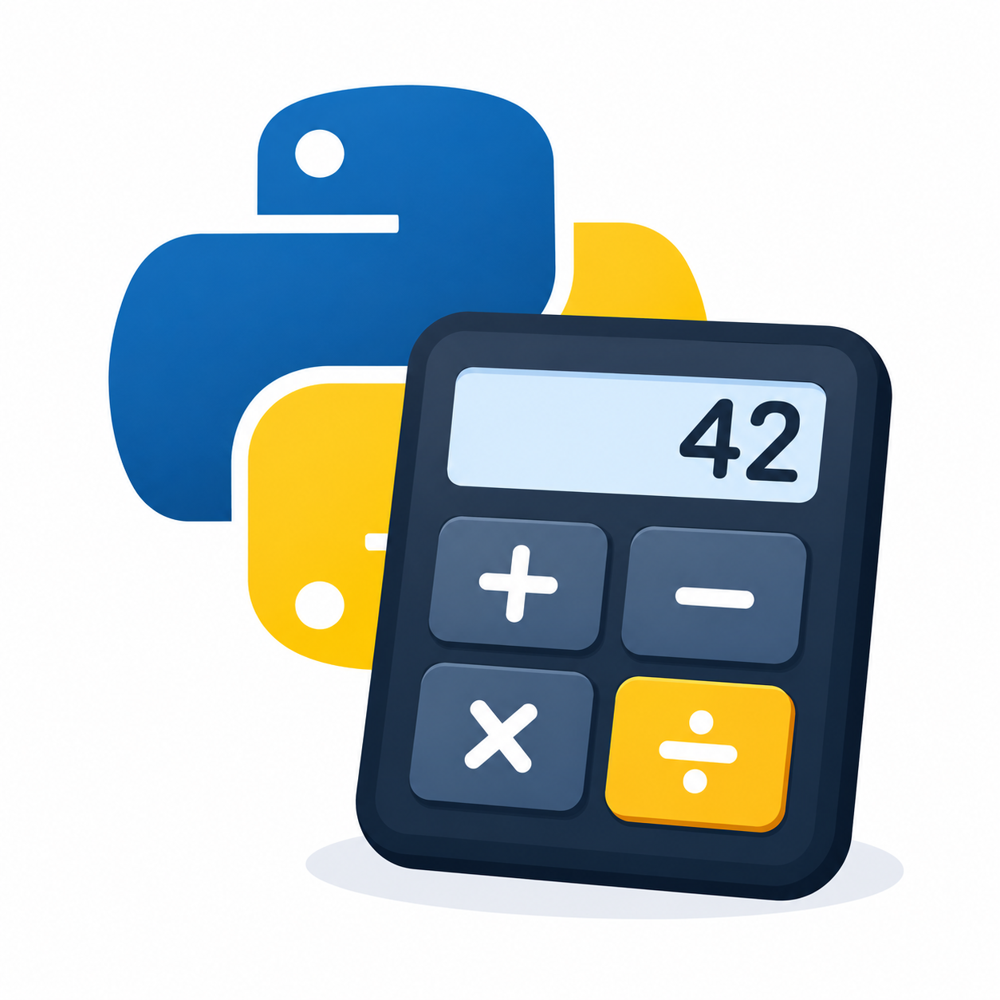

# Python Calculator

<p align="center">
  
</p>

Ein einfacher Taschenrechner, der mit **Python** entwickelt wurde.
Das Programm kann grundlegende mathematische Berechnungen durchführen und eignet sich als kleines Python-Einsteigerprojekt.

## Funktionen

Der Calculator unterstützt folgende Rechenoperationen:

* ➕ Addition
* ➖ Subtraktion
* ✖️ Multiplikation
* ➗ Division

## Installation

Klone zuerst das Repository:

```bash
git clone <DEINE-REPOSITORY-URL>
```

Wechsle anschließend in den Projektordner:

```bash
cd <DEIN-PROJEKTORDNER>
```

## Verwendung

Starte den Calculator mit Python:

```bash
python calculator.py
```

Falls dein System `python3` verwendet:

```bash
python3 calculator.py
```

Folge anschließend den Anweisungen im Terminal und gib die gewünschten Zahlen und Rechenoperationen ein.

## Voraussetzungen

* Python 3.x
* Keine zusätzlichen Python-Pakete erforderlich

## Projektstruktur

```text
python-calculator/
├── calculator.py
├── calculator-icon.png
└── README.md
```

## Ziel des Projekts

Dieses Projekt wurde erstellt, um grundlegende Python-Konzepte zu üben, beispielsweise:

* Benutzereingaben
* Variablen
* Bedingungen
* Funktionen
* Mathematische Operationen

## Lizenz

Dieses Projekt kann frei für Lern- und Übungszwecke verwendet werden.
